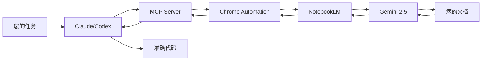

<div align="center">

# NotebookLM MCP 服务器

**让您的 CLI AI 代理 (Claude、Cursor、Codex) 直接与 NotebookLM 对话，获得基于您文档的零幻觉答案**

[](https://www.typescriptlang.org/)
[](https://modelcontextprotocol.io/)
[](https://www.npmjs.com/package/notebooklm-mcp)
[](https://github.com/PleasePrompto/notebooklm-skill)
[](https://github.com/PleasePrompto/notebooklm-mcp)

[快速开始](#快速开始) • [功能特性](#功能特性) • [文档索引](#文档索引) • [常见问题](#常见问题)

</div>

---

## 为什么需要 NotebookLM MCP？

当您告诉 Claude Code 或 Cursor "搜索我的本地文档"时，通常会遇到这些问题：

- **Token 消耗巨大** - 搜索文档需要反复读取多个文件
- **检索不准确** - 只能搜索关键词，缺少上下文关联
- **产生幻觉** - 当找不到信息时，会编造看似合理的 API
- **昂贵且缓慢** - 每个问题都需要重新读取多个文件

## 解决方案

让您的本地 AI 代理直接与 [**NotebookLM**](https://notebooklm.google/) 对话 — Google 基于 Gemini 2.5 的**零幻觉知识库**，能够从您的文档中提供智能、综合的答案。

```
您的任务 → 本地 AI 询问 NotebookLM → Gemini 综合答案 → AI 编写准确代码
```

**真正的优势**：不再需要在 NotebookLM 和编辑器之间手动复制粘贴。您的代理直接向 NotebookLM 提问并立即在 CLI 中获得答案。它通过自动追问建立深入理解 — Claude 会按顺序问多个问题，每个问题都基于前一个答案，获取具体的实现细节、边缘情况和最佳实践。

---

## 快速开始

### 1. 安装

**Claude Code:**

```bash
claude mcp add notebooklm npx notebooklm-mcp@latest
```

**Codex:**

```bash
codex mcp add notebooklm -- npx notebooklm-mcp@latest
```

**Cursor** - 添加到 `~/.cursor/mcp.json`:

```json
{
  "mcpServers": {
    "notebooklm": {
      "command": "npx",
      "args": ["-y", "notebooklm-mcp@latest"]
    }
  }
}
```

<details>
<summary>其他客户端 (Gemini, VS Code, amp)</summary>

**Gemini:**

```bash
gemini mcp add notebooklm npx notebooklm-mcp@latest
```

**VS Code:**

```bash
code --add-mcp '{"name":"notebooklm","command":"npx","args":["notebooklm-mcp@latest"]}'
```

**amp:**

```bash
amp mcp add notebooklm -- npx notebooklm-mcp@latest
```

**其他 MCP 客户端通用配置:**

```json
{
  "mcpServers": {
    "notebooklm": {
      "command": "npx",
      "args": ["notebooklm-mcp@latest"]
    }
  }
}
```

</details>

### 2. 认证 (一次性)

在聊天中对您的 AI 代理说：

```
"Log me in to NotebookLM"
```

Chrome 窗口会自动打开 → 使用 Google 登录

### 3. 创建知识库

访问 [notebooklm.google.com](https://notebooklm.google.com) → 创建笔记本 → 上传您的文档：

- 📄 PDF、Google Docs、Markdown 文件
- 🔗 网站、GitHub 仓库
- 🎥 YouTube 视频
- 📚 每个笔记本可添加多个来源

分享方式：⚙️ Share → Anyone with link → 复制链接

### 4. 开始使用

```
"I'm building with [library]. Here's my NotebookLM: [link]"
```

**就这样！** Claude 现在会根据需要向 NotebookLM 提问，在编写代码前建立专业知识。

---

## 功能特性

### 🎯 零幻觉保证

NotebookLM 拒绝回答文档中没有的信息。不会有编造的 API。

### 🤖 自主研究

Claude 自动追问相关问题，在编码前建立完整的理解。

### 📚 智能库管理

保存 NotebookLM 链接并添加标签和描述。Claude 会根据您的任务自动选择合适的笔记本。

```
"Add [link] to library tagged 'frontend, react, components'"
```

### 🔁 跨工具共享

一次设置，随处使用。Claude Code、Codex、Cursor — 所有工具共享同一个库。

### 🛠️ 工具配置文件

通过仅加载需要的工具来减少 Token 使用。

| 配置         | 工具数 | 用途                                                                                                             |
| ------------ | ------ | ---------------------------------------------------------------------------------------------------------------- |
| **minimal**  | 5      | 仅查询：`ask_question`, `get_health`, `list_notebooks`, `select_notebook`, `get_notebook`                        |
| **standard** | 10     | + 库管理：`setup_auth`, `list_sessions`, `add_notebook`, `update_notebook`, `search_notebooks`                   |
| **full**     | 16     | 所有工具包括 `cleanup_data`, `re_auth`, `remove_notebook`, `reset_session`, `close_session`, `get_library_stats` |

**配置方式:**

```bash
# CLI 配置
npx notebooklm-mcp config set profile minimal

# 环境变量配置
export NOTEBOOKLM_PROFILE=minimal
```

---

## 文档索引

📚 **完整文档**

| 文档            | 描述                                         | 链接                                                 |
| --------------- | -------------------------------------------- | ---------------------------------------------------- |
| 📥 **安装指南** | 详细安装步骤、系统要求、验证方法、卸载和升级 | [docs/installation.md](./docs/installation.md)       |
| 📖 **使用指南** | 高级用法、工作流、最佳实践、模式             | [docs/usage-guide.md](./docs/usage-guide.md)         |
| 🛠️ **工具参考** | 完整 MCP 工具 API 文档、参数说明             | [docs/tools.md](./docs/tools.md)                     |
| 🔧 **配置说明** | 环境变量、运行时配置、工具配置               | [docs/configuration.md](./docs/configuration.md)     |
| 🐛 **问题排查** | 常见问题和解决方案                           | [docs/troubleshooting.md](./docs/troubleshooting.md) |

---

## 架构



---

## 常用命令

| 意图       | 说的话                                                        | 结果                     |
| ---------- | ------------------------------------------------------------- | ------------------------ |
| 认证       | _"Open NotebookLM auth setup"_ 或 _"Log me in to NotebookLM"_ | Chrome 打开登录窗口      |
| 添加笔记本 | _"Add [link] to library"_                                     | 保存笔记本并添加元数据   |
| 列出笔记本 | _"Show our notebooks"_                                        | 列出所有保存的笔记本     |
| 先研究     | _"Research this in NotebookLM before coding"_                 | 多问题会话               |
| 选择笔记本 | _"Use the React notebook"_                                    | 设置活动笔记本           |
| 更新笔记本 | _"Update notebook tags"_                                      | 修改元数据               |
| 删除笔记本 | _"Remove [notebook] from library"_                            | 从库中删除               |
| 查看浏览器 | _"Show me the browser"_                                       | 实时观看 NotebookLM 对话 |
| 修复认证   | _"Repair NotebookLM authentication"_                          | 清除并重新认证           |
| 切换账户   | _"Re-authenticate with different Google account"_             | 更换账户                 |
| 清理重启   | _"Run NotebookLM cleanup"_                                    | 删除所有数据，重新开始   |
| 保留库     | _"Cleanup but keep my library"_                               | 保留笔记本               |
| 删除所有   | _"Delete all NotebookLM data"_                                | 完全删除                 |

---

## 与其他方案对比

| 方案                      | Token 消耗           | 设置时间            | 幻觉                | 答案质量   |
| ------------------------- | -------------------- | ------------------- | ------------------- | ---------- |
| **直接投喂文档给 Claude** | 🔴 很高 (多文件读取) | 立即                | 是 - 填补空白       | 变化的检索 |
| **网络搜索**              | 🟡 中等              | 立即                | 高 - 不可靠来源     | 看运气     |
| **本地 RAG**              | 🟡 中-高             | 数小时 (embeddings) | 中等 - 检索空白     | 取决于设置 |
| **NotebookLM MCP**        | 🟢 最少              | 5 分钟              | **零** - 未知则拒绝 | 专家综合   |

### NotebookLM 的优势

1. **由 Gemini 预处理**：上传一次文档，立即获得专家知识
2. **自然语言问答**：不仅是检索 — 实际的理解和综合
3. **多源关联**：连接 50+ 文档之间的信息
4. **引用支持**：每个答案都包含来源引用
5. **无需基础设施**：无需向量 DB、embeddings 或分块策略

---

## 常见问题

**真的零幻觉吗？**
是的。NotebookLM 专门设计为仅从上传的来源回答。如果不知道，它会直接说不知道。

**有速率限制吗？**
免费 tier 每个账户每天有查询次数限制。支持快速切换账户继续研究。

**这有多安全？**
Chrome 在本地运行。您的凭据永远不会离开您的机器。如果担心，可以使用专用的 Google 账户。

**可以看到正在发生什么吗？**
可以！说 _"Show me the browser"_ 来实时观看 NotebookLM 对话。

**这比 Claude 内置知识好在哪里？**
您的文档始终是最新的。没有训练截止。没有幻觉。非常适合新库、内部 API 或快速发展的项目。

---

## 许可证

MIT — 自由在您的项目中使用。

---

<div align="center">

Built with frustration about hallucinated APIs, powered by Google's NotebookLM

⭐ [在 GitHub 上 Star](https://github.com/PleasePrompto/notebooklm-mcp) 如果这能节省您的调试时间！

[English Version](./README_EN.md) • [报告问题](https://github.com/PleasePrompto/notebooklm-mcp/issues)

</div>
