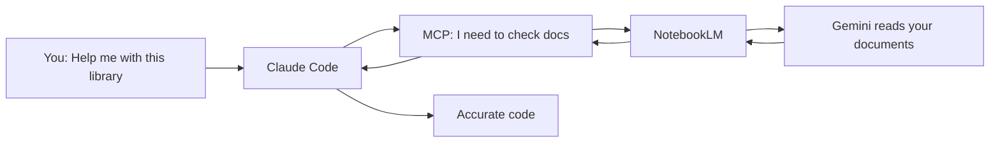

<div align="center">

# NotebookLM MCP Server

**Let your AI agent talk directly to NotebookLM and get accurate answers based on your documents**

[](https://www.typescriptlang.org/)
[](https://modelcontextprotocol.io/)
[](https://www.npmjs.com/package/notebooklm-mcp)
[](https://github.com/PleasePrompto/notebooklm-skill)
[](https://github.com/PleasePrompto/notebooklm-mcp)

</div>

---

## Part 1: What is this? Why do you need it?

### A Common Problem

Have you ever encountered this situation:

> You ask Claude to help you write code using some library's API. It confidently writes some code, but when you run it, it fails — **this API doesn't exist at all**.

This isn't Claude trying to cause trouble. The problems are:

1. **Claude's knowledge has a cutoff date** — newly released libraries, updated APIs, it might not know
2. **Claude "fills in the blanks"** — when information is insufficient, it "guesses" a seemingly reasonable answer based on experience
3. **Reading local documents consumes huge tokens** — making AI search multiple files requires consuming a lot of tokens

### The Solution

**NotebookLM** is Google's "zero-hallucination" knowledge base built on Gemini 2.0:

- You upload documents (PDFs, web pages, YouTube videos, etc.)
- NotebookLM reads and understands this content
- When you ask questions, it **only** answers based on the documents you uploaded — if it doesn't know, it says so directly

**NotebookLM MCP** is a bridge that lets your AI agent (Claude Code, Cursor, etc.) ask NotebookLM questions directly.

---

## Part 2: How does it work?

### An Analogy

Imagine this:

```
Traditional approach:
You → Send documents to Claude → Claude tries to remember → May invent APIs

Using NotebookLM MCP:
You → Claude asks "librarian" → "Librarian" checks documents → Returns accurate answer
```

**NotebookLM is that "librarian" who has thoroughly read all your documents**, and it refuses to guess.

### Workflow



### Core Advantages

| Feature | Traditional Approach | NotebookLM MCP |
|---------|---------------------|----------------|
| **Hallucination Risk** | High - May invent APIs | **Zero** - Only answers from documents |
| **Token Consumption** | High - Needs to read files repeatedly | **Low** - Only transmits Q&A results |
| **Knowledge Freshness** | Limited by training cutoff | **Always latest** - What you upload is latest |
| **Multi-document Association** | Difficult | **Simple** - Automatically synthesizes multiple sources |

---

## Part 3: 5-Minute Quick Start

<details>
<summary><b>Prerequisites</b> (click to view)</summary>

- Node.js 18+ installed
- Claude Code / Cursor / Codex (any one)
- Google account (for using NotebookLM)

</details>

### Step 1: Install (One Command)

**Claude Code:**
```bash
claude mcp add notebooklm npx notebooklm-mcp@latest
```

**Cursor:** Edit `~/.cursor/mcp.json`, add:
```json
{
  "mcpServers": {
    "notebooklm": {
      "command": "npx",
      "args": ["-y", "notebooklm-mcp@latest"]
    }
  }
}
```

### Step 2: Login to NotebookLM (One-time)

Tell your AI:
```
"Log me in to NotebookLM"
```

Chrome will automatically open. Log in with Google.

### Step 3: Create Knowledge Base

1. Visit [notebooklm.google.com](https://notebooklm.google.com)
2. Create a notebook and upload your documents
3. Click ⚙️ Share → Anyone with link → Copy link

### Step 4: Start Using

Tell your AI:
```
"I'm working with [library name]. Here's my NotebookLM: [paste link]"
```

**That's it!** Now when you ask questions, AI will automatically query NotebookLM for accurate information from your documents.

---

## Part 4: Core Concepts Explained

<details>
<summary><b>What does "zero hallucination" mean?</b></summary>

NotebookLM's design principle is: **strictly answer based on provided sources only**.

- If the document has an answer → Accurately cite and answer
- If the document doesn't have an answer → Directly say "this information is not mentioned in the document"

This is different from general large language models — general models tend to be "helpful" and will try to guess an answer even when they don't know.

</details>

<details>
<summary><b>Why do we need MCP?</b></summary>

**MCP (Model Context Protocol)** is a standard way for AI agents to use external tools.

Think of it as AI's "USB interface":
- AI itself cannot directly access the internet
- But through MCP, AI can call various "tools" (like browsers, databases)
- NotebookLM MCP is one such tool, enabling AI to query NotebookLM

</details>

<details>
<summary><b>What is automatic follow-up?</b></summary>

This is one of the most powerful features. When you ask a complex question, AI will:

1. First ask NotebookLM a basic question
2. Based on the answer, ask a more in-depth follow-up question
3. Repeat this process until fully understood

**Example:**
```
You: "How do I use this state management library?"

AI → NotebookLM: "What are the core concepts of this library?"
    → After getting answer →
    → NotebookLM: "How do I initialize a store?"
    → After getting answer →
    → NotebookLM: "How do I handle async actions?"

Final: AI synthesizes all answers and writes accurate code
```

</details>

---

## Part 5: Installation Guide

### System Requirements

| Requirement | Minimum | Recommended |
|-------------|---------|-------------|
| Node.js | 18.0.0 | 20.x LTS |
| Memory | 2 GB | 4 GB |
| Disk Space | 500 MB | 1 GB |

### Install by Client

<details>
<summary><b>Claude Code</b></summary>

```bash
# Install
claude mcp add notebooklm npx notebooklm-mcp@latest

# Verify
claude mcp list

# Uninstall
claude mcp remove notebooklm
```

</details>

<details>
<summary><b>Cursor</b></summary>

Edit `~/.cursor/mcp.json`:

```json
{
  "mcpServers": {
    "notebooklm": {
      "command": "npx",
      "args": ["-y", "notebooklm-mcp@latest"]
    }
  }
}
```

**Note:** You need to restart Cursor after editing.

</details>

<details>
<summary><b>Codex</b></summary>

```bash
# Install
codex mcp add notebooklm -- npx notebooklm-mcp@latest

# Verify
codex mcp list

# Uninstall
codex mcp remove notebooklm
```

</details>

<details>
<summary><b>Gemini / VS Code / Others</b></summary>

**Gemini:**
```bash
gemini mcp add notebooklm npx notebooklm-mcp@latest
```

**VS Code:**
```bash
code --add-mcp '{"name":"notebooklm","command":"npx","args":["notebooklm-mcp@latest"]}'
```

**Generic config format:**
```json
{
  "mcpServers": {
    "notebooklm": {
      "command": "npx",
      "args": ["notebooklm-mcp@latest"]
    }
  }
}
```

</details>

---

## Part 6: Usage Scenarios and Examples

### Scenario 1: Learning a New Framework

**Problem:** You want to use a new UI framework but don't know the APIs

**Action:**
```
"I'm building an app with [framework name]. Here's the documentation NotebookLM: [link]"
"How does this framework's component system work?"
"Give me a complete component example"
```

**Result:** AI gives you accurate code based on documentation, won't invent non-existent APIs.

---

### Scenario 2: Querying Internal API Documentation

**Problem:** Your company's internal API documentation is complex

**Action:**
1. Upload internal documentation to NotebookLM
2. Tell AI the link
3. Ask: "How does our user authentication flow work?"

**Result:** AI accurately quotes internal documentation and gives correct API call methods.

---

### Scenario 3: Synthesizing Multi-source Information

**Problem:** Information is scattered across multiple documents, videos, and web pages

**Action:**
- Create a notebook in NotebookLM
- Add multiple sources (PDFs, websites, YouTube videos, etc.)
- Let AI synthesize answers

**Result:** NotebookLM associates all sources and provides comprehensive answers.

---

### Quick Command Reference

| Intent | Say to AI | Result |
|--------|-----------|--------|
| Authenticate | "Log me in to NotebookLM" | Opens login window |
| Add notebook | "Add [link] to library" | Saves notebook |
| List notebooks | "Show our notebooks" | Shows all saved notebooks |
| Select notebook | "Use the React notebook" | Sets active notebook |
| View browser | "Show me the browser" | View NotebookLM conversation in real-time |
| Fix auth | "Repair NotebookLM authentication" | Clears and re-authenticates |

---

## Part 7: Advanced Configuration

<details>
<summary><b>Tool Profiles (Reduce Token Usage)</b></summary>

Reduce token usage by only loading the tools you need:

| Profile | Tools | Included Tools |
|---------|-------|----------------|
| **minimal** | 5 | Query only: `ask_question`, `get_health`, `list_notebooks`, `select_notebook`, `get_notebook` |
| **standard** | 10 | + Library management: `setup_auth`, `list_sessions`, `add_notebook`, `update_notebook`, `search_notebooks` |
| **full** | 16 | All tools |

**Configuration:**
```bash
# Environment variable
export NOTEBOOKLM_PROFILE=minimal

# CLI
npx notebooklm-mcp@latest --profile minimal
```

</details>

<details>
<summary><b>Environment Variables</b></summary>

**Browser behavior:**
```bash
export HEADLESS=false          # Show browser window
export BROWSER_TIMEOUT=60000   # Timeout (milliseconds)
```

**Stealth mode (human-like behavior):**
```bash
export STEALTH_ENABLED=true
export STEALTH_HUMAN_TYPING=true
export TYPING_WPM_MIN=160      # Typing speed range
export TYPING_WPM_MAX=240
```

**Session management:**
```bash
export MAX_SESSIONS=10         # Max concurrent sessions
export SESSION_TIMEOUT=900     # Session timeout (seconds)
```

For complete configuration, see: [docs/configuration.md](./docs/configuration.md)

</details>

<details>
<summary><b>Troubleshooting</b></summary>

**"Chrome not found"**
- Linux: `sudo apt install chromium-browser`
- macOS/Windows: Chrome installs automatically

**"ProcessSingleton error"**
- Close all Chrome windows and try again
- Or set `NOTEBOOK_PROFILE_STRATEGY=isolated`

**"Session expired"**
- Run: "Re-authenticate with NotebookLM"

For more solutions: [docs/troubleshooting.md](./docs/troubleshooting.md)

</details>

---

## Part 8: More Documentation

| Document | Description | Link |
|----------|-------------|------|
| Installation Guide | Detailed installation steps, system requirements, verification, uninstall and upgrade | [docs/installation.md](./docs/installation.md) |
| Usage Guide | Advanced usage, workflows, best practices, patterns | [docs/usage-guide.md](./docs/usage-guide.md) |
| Tool Reference | Complete MCP tool API documentation, parameter descriptions | [docs/tools.md](./docs/tools.md) |
| Configuration | Environment variables, runtime configuration, tool profiles | [docs/configuration.md](./docs/configuration.md) |
| Troubleshooting | Common problems and solutions | [docs/troubleshooting.md](./docs/troubleshooting.md) |

---

## FAQ

<details>
<summary><b>Really zero hallucination?</b></summary>

Yes. NotebookLM is designed specifically to answer only from uploaded sources. If it doesn't know, it will say so directly.
</details>

<details>
<summary><b>Are there rate limits?</b></summary>

The free tier has a daily query limit per account. Supports quickly switching accounts to continue research.
</details>

<details>
<summary><b>How secure is this?</b></summary>

Chrome runs locally. Your credentials never leave your machine. If concerned, you can use a dedicated Google account.
</details>

<details>
<summary><b>Can I see what's happening?</b></summary>

Yes! Say "Show me the browser" to your AI to watch the NotebookLM conversation in real-time.
</details>

---

<div align="center">

Built with frustration about hallucinated APIs, powered by Google's NotebookLM

⭐ [Star on GitHub](https://github.com/PleasePrompto/notebooklm-mcp) if this saves your debugging time!

[中文版](./README.md) • [Report Issues](https://github.com/PleasePrompto/notebooklm-mcp/issues)

</div>
